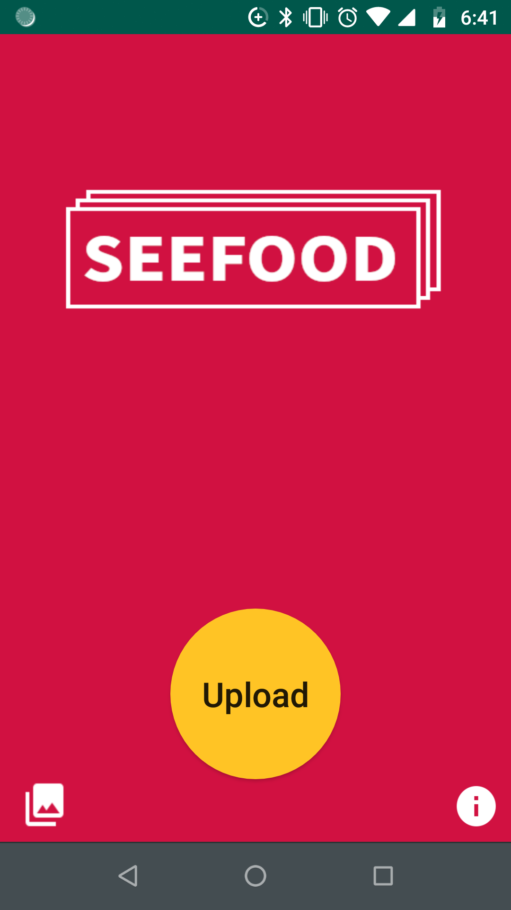
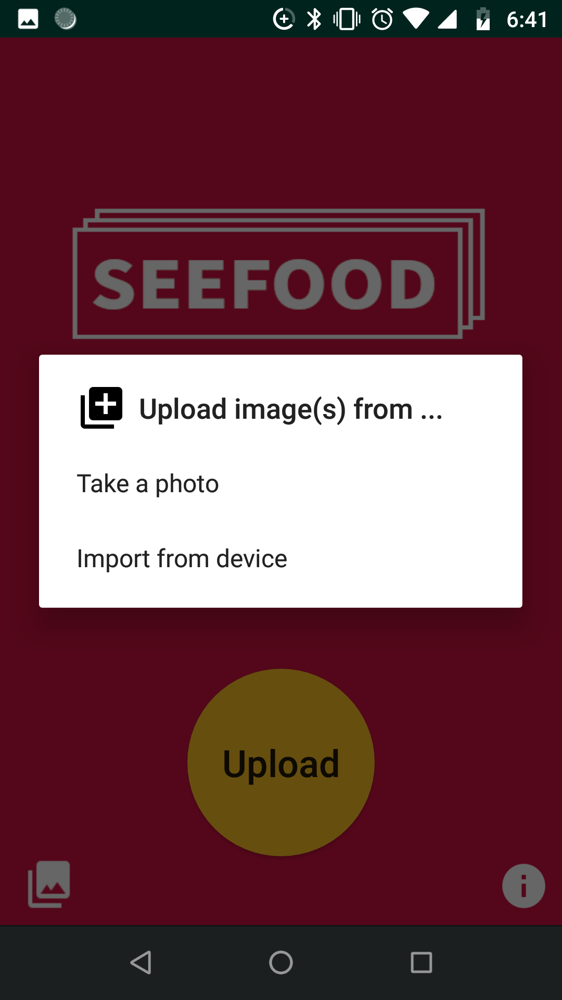
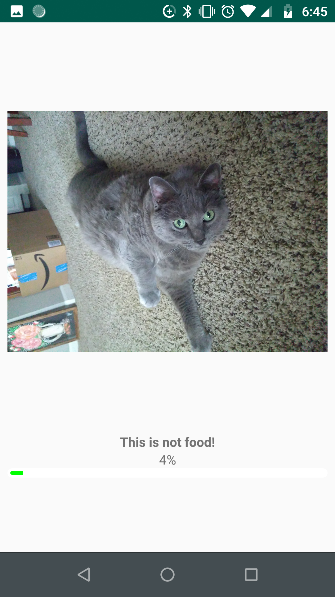

# SeeFood App 
[](https://travis-ci.com/IbrahimNM/seefood_app) [](https://github.com/IbrahimNM/seefood_app/releases/) [](https://opensource.org/licenses/Apache-2.0) [](https://www.codefactor.io/repository/github/ibrahimnm/seefood_app)


## Getting Started

These instructions will get you a copy of the project up and running on your mobile for development and testing purposes.

### Prerequisites

What things you need to install the software and how to install them

```
An Android mobile device with a minimum SDK of 18.
```

```
Internet connectivity.
```

### Installing

* Running on Android Device

  1. Download and unzip project folder from GitHub
  2. Connect Android device to computer via USB cable and enable file sharing
  3. Copy the release APK from the release folder within the root directory of the project into a desired folder on the Android Device
  4. Using the Android Device, click the APK file and give the app permissions to install

## Deployment

Once installed onto the Android Device, the SeeFood app can be deplyed through the device's app menu by clicking on its icon.

### Note

If issues are experienced during installation, make sure that the Android device is able to install apps from Unknown Sources. This
setting can be changed at ```Settings->Security``` and checking the option under Device Administration.

### Using the App

The SeeFood app allows users to submit images to a server hosted through AWS (Amazon Web Services). 
The server uses a pretrained neural network to assess whether the submited images contain food. A result screen is displayed after 
image submission, which shows the user the confidence of the neural network's decision and its answer. 

  

### Design

This app was designed using Adapter Design Patterns, several additional classes, and an additional repository to store and modify the
AWS server. The app was developed in modules assigned to each member of the team. Ibrahim was responsible for the UI and the ability to 
submit images. Brittany was responsible for the the gallery and uploading/downloading its contents. Rafael was responsible for 
maintaining and managing the server.

Classes created to manage the UI:
  * Feedback_Window:
    * This class is responsible for the displaying the selected or captured image along with the confidence rate produced by the AI.
    Thus, Feedback_Window class is executing multiple functionalities that were specified for the application.These functionalities 
    include connecting to the AI via EC2, uploading images(s) to the server, and graphically displaying the dfidence result transmitted 
    by the server. In addition, the Feedback_Window class will prompt the user about any possible issues that could arise before or 
    during the AI processing conducted on the server.
    
Classes created to manage the Gallery:
  * DepthPageTransformer:
    * This class was a custom transformer to be used with the viewPager in the gallery. This class adjusts the image fragments it is 
    applied to in order to inflate the image to a slightly larger size when it is opened by the user for horizontal scrolling through
    the gallery.
    
  * DetailActivity:
    * This class is an Activity that creates the viewPager in the gallery such that the user is able to select an image, it will be 
    inflated via the DepthPageTransformer, and the user is able to swipe horizontally(left or right) through all of the images in the 
    gallery. This class also offers the ability of the user to select an image while in the viewPager for selection in order to view its 
    stats as determined by the AI.
    
  * DownloadFileAsync:
    * This class extends AsyncTask in order to download the gallery from the server as a zip file. It opens the web connection for the 
    server and initializes and completes the download of the folder and its contents using streams. Note, that this class completes the 
    download of the zip folder in th background of the application. Thus, when this class is reached during execution of the gallery 
    functionality, the app waits until the gallery has been fully downloaded before commencing actions such that the entire folder is
    successfully downloaded first.
    
  * Gallery:
    * This class is an Activity that executes the download of the zip file, unzips the folder and extracts the images onto the device,
    populates the gallery with said images, and executes the listener that opens the viewPager for swiping through the gallery. This is
    how the images are displayed as a grid to the user. Additionally, this class also deletes the zip folder and the directories 
    containing the pictures regularly, such that the gallery is always up-to-date for the user.
    
  * GalleryAdapter:
    * This class is a custom adapter for the RecyclerView used to display all of the images within the gallery as GalleryItem objects. 
    The class displays the images in the modified RecyclerView in a grid using Glide as the image loaded library.
    
  * GalleryItem:
    * This class defines the GalleryItem object by assigning a name and url to each of the images stored within th gallery. This is 
    useful for calling the FeedBack_Window object, which requires the Uri of the image.
    
  * ImageClickListener:
    * This class is a custom listener that opens the viewPager should the user select any image in the GalleryAdapter. The image
    selected will be inflated to a slightly larger size by the DepthPageTransformer, and the images can be swiped through via the 
    DetailActivity.

## Built With

* [Gradle](https://gradle.org/) - The building system used.
* [Glide](https://github.com/bumptech/glide) - Gallery library used.
* [AWS](https://aws.amazon.com/) - Web services.

## Versioning

We use [Github](https://github.com/) for versioning. For the versions available, see the [tags on this repository](https://github.com/IbrahimNM/seefood_app/tags).

## Authors

* **Brittany Woods** - [Github account](https://github.com/w029bnw)
* **Ibrahim Almohaimeed** - [Github account](https://github.com/IbrahimNM)
* **Rafael Nunez** - [Github account](https://github.com/rnunez95)

## License

This project is licensed under the Apache 2.0 License - see the [LICENSE](LICENSE) file for details.

## Acknowledgments

* A tutorial created by Suleiman was used to create the Gallery and implement the viewPager on image selection.
  * https://blog.iamsuleiman.com/image-gallery-app-android-studio-1-4-glide/
  * https://github.com/Suleiman19/Gallery
